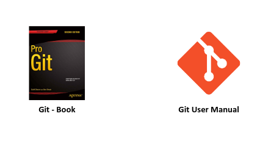

[![Contributors][contributors-shield]][contributors-url]
[![Forks][forks-shield]][forks-url]
[![Stargazers][stars-shield]][stars-url]
[![Issues][issues-shield]][issues-url]
[![MIT License][license-shield]][license-url]
[![LinkedIn][linkedin-shield]][linkedin-url]

<p align="center">
  <br/>
  <a href="#">
    
  </a>

  <h3 align="center">Treinamento de Git / Github</h3>

  <p align="center">
    Treinamento de Git / Github do Básico ao Avançado com Projetos Dirigidos
    <br />
    <hr/>
    <br/>
  </p>
</p>

## Referências

<p align="center">
  <br/>
  <a href="#">
    
  </a>
</p>

* **Links**
  * [Livro Pro Git](https://git-scm.com/book/en/v2)
  * [Manual do Usuário](https://git-scm.com/docs/user-manual)

## Notas de Aula

* [Entendendo o Controle de Versão](#)
* [A História do Git](#)
* [Os Fluxos de Estado do Git](#)
* [Como Instalar e Configurar o Git](#)
* [Boas Práticas de um Commit](#)
* [Introdução ao Git](#)
* [Trabalhando com Branches no Git](#)


## Estrutura de Arquivos

```
Treinamento-Git-GitHub
|   LICENSE.txt
|   README.md
|
└───Parte1-Introdução
|   |   Introdução-ao-Git-GitHub.pdf
|   |   Projeto-Dirigido-1
│
└───Parte2-Técnicas-Avançadas
│   |   Técnicas-Avançadas-Git-GitHub.pdf
|   |   Projeto-Dirigido-2
│   
└───Images
|    │  github.png
|    |  reference.png

```

<!-- MARKDOWN LINKS & IMAGES -->

[contributors-shield]: https://img.shields.io/github/contributors/raulduarte/Treinamento-Git-GitHub?style=flat-square
[contributors-url]: https://github.com/raulduarte/Treinamento-Git-GitHub/graphs/contributors
[forks-shield]: https://img.shields.io/github/forks/raulduarte/Treinamento-Git-GitHub?style=flat-square
[forks-url]: https://github.com/raulduarte/Treinamento-Git-GitHub/network/members
[stars-shield]: https://img.shields.io/github/stars/raulduarte/Treinamento-Git-GitHub?style=flat-square
[stars-url]: https://github.com/raulduarte/Treinamento-Git-GitHub/stargazers
[issues-shield]: https://img.shields.io/github/issues/raulduarte/Treinamento-Git-GitHub?style=flat-square
[issues-url]: https://github.com/raulduarte/Treinamento-Git-GitHub/issues
[license-shield]: https://img.shields.io/github/license/raulduarte/Treinamento-Git-GitHub?style=flat-square
[license-url]: https://github.com/raulduarte/Treinamento-Git-GitHub/blob/master/LICENSE.txt
[linkedin-shield]: https://img.shields.io/badge/-LinkedIn-black.svg?style=flat-square&logo=linkedin&colorB=555
[linkedin-url]: https://www.linkedin.com/in/raul-duarte/
